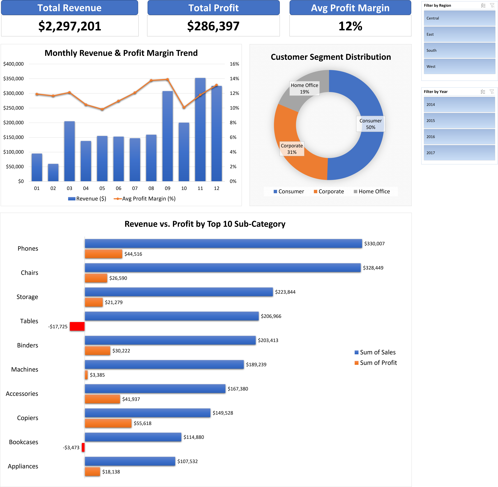

# What Drives Superstore Profitability?
### Excel Dashboard | Data Cleaning | Business Insight



---

## Gambaran Umum

Analisis menyeluruh terhadap **9.994 transaksi retail** dari dataset Kaggle Superstore (2014-2017) menggunakan Microsoft Excel. Proyek ini menjawab satu pertanyaan bisnis utama:

> *Sub-category dan region mana yang benar-benar menguntungkan dan mana yang justru merugikan meski revenue-nya tinggi?*

---

## Dataset

| Field | Detail |
|---|---|
| Sumber | [Kaggle - Sample Superstore](https://www.kaggle.com/datasets/vivek468/superstore-dataset-final) |
| Periode | 2014-2017 |
| Jumlah baris | 9.994 transaksi |
| Jumlah kolom | 21 (+ 3 kolom turunan) |
| Mata uang | USD ($) |

---

## Tools & Teknik

`Microsoft Excel` `Power Query` `Pivot Table` `Combo Chart` `Grouped Bar Chart` `Donut Chart` `Slicer` `GETPIVOTDATA` `TEXT()` `YEAR()` `TRIM()` `Data Validation`

---

## Struktur File

```
1_Superstore_Sales_Performance/
|
|-- SalesPortfolio_Fadlan.xlsx    # File Excel utama
|   |-- RAW_DATA                  # Data mentah hasil import - tidak diubah
|   |-- CLEAN_DATA                # Data bersih beserta kolom turunan
|   |-- ANALYSIS                  # Semua Pivot Table (5 pivot)
|   |-- DASHBOARD                 # Dashboard final - output utama
|   |-- DOCUMENTATION             # Data source, dictionary, cleaning log
|
|-- dashboard_screenshot.png      # Tampilan dashboard lengkap
|-- grouped_bar_chart.png         # Chart Revenue vs Profit Top 10
|-- README.md                     # File ini
```

---

## Proses Pengerjaan

### 1. Import Data & Cleaning

**Tantangan yang ditemukan:**

Dataset Superstore menggunakan titik (.) sebagai pemisah desimal, sementara komputer dengan locale Indonesia menggunakan koma (,). Akibatnya, nilai seperti `261.96` terbaca sebagai `26196` - meleset 1.000x lipat dari nilai sebenarnya dan membuat seluruh angka analisis menjadi tidak valid.

**Solusi yang ditemukan:**
- Menonaktifkan "Use System Separators" di Excel Options, kemudian menyesuaikan penggunaan separatornya
- Import via Power Query - menghapus langkah "Changed Type" yang dibuat otomatis oleh Excel

**Langkah cleaning yang dilakukan:**

| # | Masalah | Kolom | Solusi | Baris Terdampak |
|---|---|---|---|---|
| 1 | Decimal conflict saat import CSV | Sales, Profit, Discount | Power Query -> hapus auto Changed Type | 9.994 |
| 2 | Order Date sebagian terbaca sebagai teks | Order Date | Text to Columns -> format MDY | Sebagian baris |
| 3 | Order_Month menampilkan tanggal penuh | Order_Month | Diperbaiki otomatis setelah Order Date difix | Sebagian baris |
| 4 | Profit_Margin menampilkan #VALUE! | Profit_Margin | Diperbaiki setelah masalah import diselesaikan | Sebagian baris |
| 5 | Duplikat baris | Semua kolom | Remove Duplicates - 0 duplikat ditemukan | 0 |
| 6 | Missing values | Semua kolom | COUNTBLANK - tidak ada di kolom kritis | 0 |

**Kolom turunan yang ditambahkan:**

| Kolom | Formula | Tujuan |
|---|---|---|
| Order_Month | `=TEXT([@[Order Date]],"MM")` | Pengelompokan tren bulanan di Pivot Table |
| Order_Year | `=YEAR([@[Order Date]])` | Filter tahun di Slicer dashboard |
| Profit_Margin | `=[@Profit]/[@Sales]` | KPI profitabilitas per transaksi |

### 2. Analisis

Membangun **4 Pivot Table terpisah** - untuk menjaga independensi antar visualisasi:

| Pivot | Tujuan | Tipe Chart |
|---|---|---|
| PT_Revenue&ProfitMargin | Revenue & Avg Profit Margin per bulan | Combo Chart (Bar + Line) |
| PT_SubCategory | Performa Top 10 Sub-Category | Grouped Bar (Revenue + Profit) |
| PT_Region | Performa per Region | - |
| PT_RevenueSegmentCustomer | Distribusi Customer Segment | Donut Chart |

### 3. Dashboard

Dashboard satu halaman dengan komponen berikut:
- **3 KPI Card** - Total Revenue, Total Profit, Avg Profit Margin
- **Combo Chart** - Monthly Revenue (Bar) + Profit Margin Trend (Line)
- **Grouped Bar Chart** - Revenue vs Profit, Top 10 Sub-Category
- **Donut Chart** - Distribusi Customer Segment
- **Slicer** - Filter by Region & Year (terhubung ke semua 5 Pivot)

---

## Key Insights

### 1. Tables: Revenue Tinggi, Kerugian Tersembunyi
Sub-category Tables menghasilkan **revenue $206.966** namun mencatatkan **net loss -$17.725** (margin: -8,6%). Pola ini konsisten di seluruh region, mengindikasikan bahwa diskon yang terlalu agresif - bukan lemahnya demand - adalah penyebab utamanya. Bookcases menunjukkan pola serupa dengan net loss -$3.473 meski revenue $114.880.

### 2. Copiers: Volume Rendah, Margin Tertinggi
Copiers hanya berada di posisi ke-8 dari sisi revenue ($149.528) namun memberikan **profit tertinggi ($55.618, margin ~37%)** - hampir 3x rata-rata perusahaan sebesar 12%. Ini membuktikan bahwa volume revenue semata adalah indikator performa yang menyesatkan.

### 3. Pola Musiman Q4
Revenue secara konsisten memuncak di **November-Desember**, menyumbang ~35% dari total penjualan tahunan. Pola yang dapat diprediksi ini membuka peluang untuk melakukan pre-stock produk high-margin (Copiers, Accessories) 6-8 minggu sebelum Q4 guna memaksimalkan profitabilitas di periode peak.

### 4. Segment Consumer Dominan di Volume, Bukan di Nilai
Segment Consumer menyumbang 50% dari total revenue namun menunjukkan **nilai rata-rata per transaksi terendah** dibanding Corporate dan Home Office - mengindikasikan perlunya strategi upsell yang berbeda per segmen.

---

## Rekomendasi Bisnis

1. **Batasi diskon Tables dan Bookcases maksimal 20%** untuk menghentikan erosi margin pada lini produk yang revenue-nya tinggi namun terus merugi
2. **Prioritaskan Copiers dan Accessories** dalam alokasi pemasaran - demand stabil dengan margin 2-3x rata-rata perusahaan
3. **Pre-stock produk high-margin sebelum Q4** - manfaatkan pola musiman yang konsisten untuk memaksimalkan profitabilitas di periode peak
4. **Kembangkan program khusus segment Corporate** - lebih sedikit transaksi namun nilai per order lebih tinggi berarti cost of acquisition per dollar revenue lebih rendah

---

## Yang Dipelajari

**Teknis:**
Menangani konflik decimal separator antara dataset internasional (titik) dan Excel dengan locale Indonesia (koma) - tantangan rekayasa data nyata yang membutuhkan pemahaman mendalam tentang pengaturan locale Excel dan perilaku inferensi tipe data di Power Query.

**Analitis:**
Revenue bukan profitabilitas. Sub-category dengan revenue tertinggi bisa sekaligus menjadi penyumbang kerugian terbesar, perbedaan krusial yang mengubah prioritas strategi bisnis secara fundamental.

**Proses:**
Nilai yang ada mendokumentasikan setiap keputusan cleaning. Mampu menjelaskan *mengapa* setiap langkah dilakukan (bukan hanya *apa* yang dilakukan) adalah yang membedakan analisis yang kredibel dari output yang kebetulan benar.

**Komunikasi:**
Insight tanpa angka adalah opini. Insight dengan angka tanpa konteks adalah trivia. Insight dengan angka, konteks, dan rekomendasi adalah analisis.

---

## Tautan

- Lihat portfolio lengkapnya di Notion: https://bit.ly/PortfolioDataAnalyst_Fadlan

---
*Dataset: Kaggle Sample Superstore | Periode analisis: 2014-2017 | Tool: Microsoft Excel*
