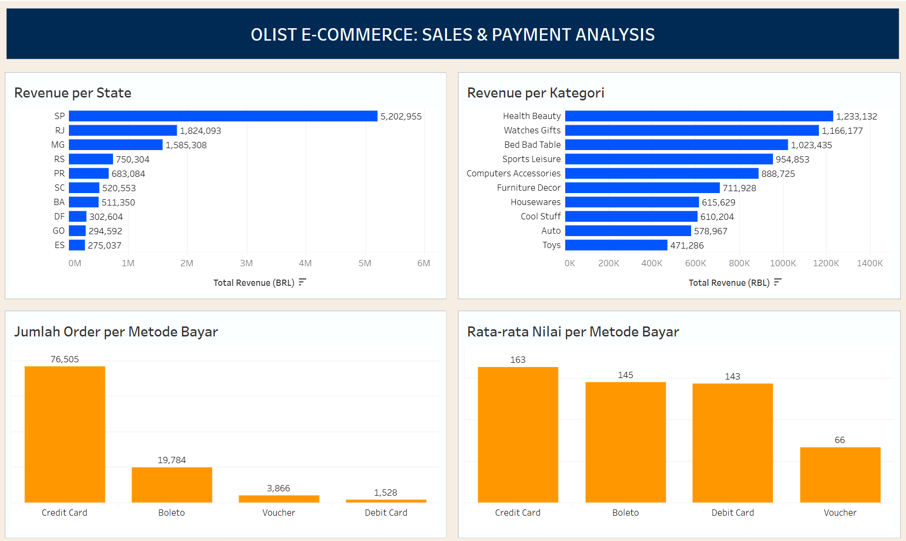

# Olist E-Commerce: Sales & Payment Analysis
### PostgreSQL | DBeaver | Tableau Public

🔗 [Lihat dashboard interaktif di Tableau Public](https://public.tableau.com/app/profile/fadlan.fadilah/viz/SalesPaymentAnalysisDashboard/Dashboard?publish=yes)

---

## Gambaran Umum
Analisis komprehensif terhadap 99.442 transaksi pada sebuah e-commerce dari dataset Brazilian E-Commerce Public Dataset by Olist (2016-2018) menggunakan query SQL dan visualisasi Tableau. Proyek ini bertujuan menjawab beberapa pertanyaan bisnis: 
- Wilayah mana dan kategori apa yang menjadi sumber pendapatan tertinggi
- Metode pembayaran yang paling dominan digunakan customer

---

## Dataset
| Field | Detail |
|---|---|
| Sumber | [Kaggle - Brazilian E-Commerce Public Dataset by Olist](https://www.kaggle.com/datasets/olistbr/brazilian-ecommerce) |
| Periode | 2016-2018 |
| Jumlah baris | 99.442 transaksi |
| Jumlah tabel | 9 tabel |
| Mata uang | BRL |

## Tools & Teknik
`PostgreSQL` `DBeaver` `Tableau Public` `JOIN` `GROUP BY` `HAVING` `COUNT` `DISTINCT` `Data Validation`

## Proses Pengerjaan
### 1. Import Data & Cleaning

**Tantangan:**
Ketika proses impor dilakukan, terdapat permasalahan ketidaksesuaian tipe data yang digunakan pada tabel order_reviews, tepatnya pada kolom review_comment_message. Kolom tersebut awalnya diatur bertipe data VARCHAR(50) yang pada akhirnya tidak dapat menampung teks review yang sangat panjang.
**Solusi yang ditemukan:**
Mengubah tipe data VARCHAR menjadi text agar kolom tersebut dapat menampung data yang diimpor.
**Langkah Cleaning:**
- Memeriksa kesesuaian jumlah baris yang masuk ke database dengan yang ada pada file aslinya
- Pemeriksaan nilai apakah terdapat Null atau nominal harga mengandung negatif
- Validasi relasi antar tabel menggunakan LEFT JOIN, misalnya memeriksa apakah setiap `order_id` di tabel `orders` benar-benar punya pasangan di tabel `order_items`

### 2. Analisis
Melakukan aktivitas query menggunakan DBeaver dengan menghasil beberapa temuan berikut:
- Query 1 - revenue dan jumlah order per state
- Query 2 - revenue per kategori khusus order "delivered”
- Query 3 - metode pembayaran, rata-rata nilai, dan rata-rata cicilan

## Key Insights
### Insight 1
São Paulo (SP) mendominasi revenue dengan BRL 5,2 juta, hampir 3x lipat state kedua (RJ: BRL 1,8 juta), mengindikasikan konsentrasi pasar yang tinggi di satu wilayah.
### Insight 2
Health Beauty memimpin revenue kategori (BRL 1,2 juta),diikuti Watches Gifts dan Bed Bath Table, ketiganya menyumbang lebih dari 40% total revenue top 10 kategori.
### Insight 3
Credit Card adalah metode pembayaran dominan (76.505 order, ~75% dari total) dengan rata-rata nilai transaksi tertinggi (BRL 163) dan rata-rata 3,5 kali cicilan, mencerminkan budaya kredit yang kuat di pasar Brazil.
### Insight 4
Voucher memiliki rata-rata nilai transaksi terendah (BRL 66), hampir 60% lebih rendah dari Credit Card, hal ini mengindikasikan voucher cenderung dipakai untuk pembelian bernilai kecil

## Rekomendasi Bisnis
1. Diversifikasi pasar di luar Sao Paulo. Pertimbangkan kampanye pemasaran yang lebih agresif di wilayah dengan potensi pertumbuhan seperti RS dan PR yang sudah masuk top 5 revenue.
2. Prioritaskan kategori Health Beauty dan Watches Gifts dalam alokasi stok dan promosi, keduanya memimpin revenue dengan margin yang konsisten dan demand yang stabil.
3. Optimalkan pengalaman pembayaran kartu kredit - dengan 76% transaksi menggunakan kartu kredit dan rata-rata 3,5 kali cicilan, pertimbangkan penawaran cicilan 0% untuk kategori bernilai tinggi guna mendorong konversi lebih besar.

## What I Learned
- Technical: Menangani ketidaksesuaian tipe data (VARCHAR vs TEXT yang dibutuhkan saat setup database.
- Analytical: Data yang terlibat lengkap dan valid secara teknis belum tentu benar secara bisnis. Validasi sistematis sebelum analisis merupakan langkah yang tidak bisa dilewatkan.
- Process: Memisahkan proses analisis (SQL/DBeaver) dari visualisasi (Tableau) dengan mengexport hasil query sebagai CSV merupakan alur kerja yang realistis dan efisien.

## Links
- 🔗 [Dashboard Tableau Public](https://public.tableau.com/app/profile/fadlan.fadilah/viz/SalesPaymentAnalysisDashboard/Dashboard?publish=yes)
- 📁 [Dataset Kaggle](https://www.kaggle.com/datasets/olistbr/brazilian-ecommerce)

---
*Dataset: Kaggle Brazilian E-Commerce by Olist · 
Tools: PostgreSQL, DBeaver, Tableau Public*